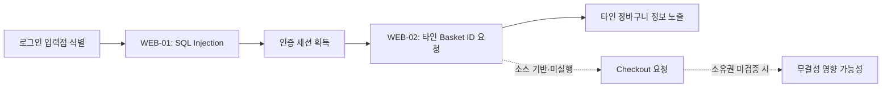

# OWASP Top 10:2025 기반 OWASP Juice Shop 모의침투

## 1. 실습 원칙: 많이 찾기보다 정확히 찾아보기

Juice Shop에는 수많은 의도적 취약점이 있다. 하지만 소스에서 위험해 보이는 코드를 찾았다고 전부 “재현 완료”라고 쓰면 보고서의 신뢰도가 떨어진다. 따라서 결과를 다음 세 단계로 나눴다.

| 상태 | 의미 |
|---|---|
| **동적 확인** | 로컬 컨테이너에서 최소·비파괴 요청으로 실제 동작을 재현함 |
| **정적 확인** | 소스 코드와 배포 구성을 통해 통제 결함을 확인함 |
| **정적 후보** | 위험 경로는 확인했지만 파일 쓰기·DoS·외부 SIEM 검증은 실행하지 않음 |

특히 타인 장바구니 checkout, 파일 쓰기, YAML 리소스 고갈은 상태 변경 또는 가용성에 영향을 줄 수 있어 실행하지 않았다. 이 구분 덕분에 “실제로 확인한 영향”과 “소스 기반으로 예상되는 영향”을 혼동하지 않을 수 있다.

## 2. 대상·범위·방법

| 항목 | 내용 |
|---|---|
| 대상 | `bkimminich/juice-shop:latest` 기반 로컬 컨테이너 |
| 접근 주소 | `http://127.0.0.1:3000` |
| 네트워크 노출 | `127.0.0.1:3000:3000` 루프백 바인딩 |
| 사용 데이터 | 임시 계정 A/B와 공개 상품만 사용 |
| 제외 범위 | 공개 데모, 외부 서비스, 실제 결제, 실제 개인정보 수집, DoS |
| 증적 관리 | JWT·쿠키·비밀번호·계정 식별값은 보고서에 기록하지 않음 |

테스트 흐름은 OWASP Web Security Testing Guide의 애플리케이션 매핑, 인증, 인가, 입력 검증, 보고 절차를 참고했다. [OWASP WSTG](https://owasp.org/projects/web-security-testing-guide)

1. Docker 실행 상태와 `localhost` 접근 범위를 확인했다.
2. 브라우저 개발자 도구 Network 탭과 공개 API 문서를 통해 API를 매핑했다.
3. 정상 요청과 최소 변경 요청의 응답 상태·결과 차이를 비교했다.
4. 임시 계정 A/B를 사용해 수평 권한 검증을 했다.
5. 소스 코드와 대조해 근본 원인과 수정 지점을 분석했다.

## 3. OWASP Top 10:2025 커버리지 요약

| OWASP 항목 | 판정 | 주요 결과 |
|---|---|---|
| A01 Broken Access Control | **동적 확인** | 타인 Basket 조회(BOLA/IDOR), Open Redirect |
| A02 Security Misconfiguration | **동적 확인** | 인증 없는 `/metrics`의 운영 지표 노출 |
| A03 Software Supply Chain Failures | 정적 확인 | lockfile 비활성화, 범위 버전·`npm install` 기반 빌드 |
| A04 Cryptographic Failures | 정적 확인 | 하드코딩 JWT 개인키, MD5 비밀번호 해시 |
| A05 Injection | **동적 확인** | 로그인·상품 검색 SQL Injection |
| A06 Insecure Design | **동적 확인** | 음수 수량을 장바구니에 저장 가능 |
| A07 Authentication Failures | **동적 확인** | 한 글자 비밀번호 허용, 로그인 시도 제한 미관찰 |
| A08 Software or Data Integrity Failures | 정적 후보 | YAML·ZIP 업로드 위험 경로 |
| A09 Security Logging and Alerting Failures | 정적 후보 | 보안 이벤트 감사·경보 흐름 미확인 |
| A10 Mishandling of Exceptional Conditions | **동적 확인** | 상세 DB 오류·프레임워크 버전·스택 흔적 노출 |

## 4. A05 — Injection: 인증과 검색에서 발견한 SQL Injection

### 4-1. WEB-01: 로그인 SQL Injection

로그인 API `POST /rest/user/login`은 이메일과 비밀번호 관련 값을 SQL 문자열에 직접 결합한 뒤 실행한다. [`login.ts` 34행](https://github.com/juice-shop/juice-shop/blob/1618a611b173b4bf114028e6e02549950606e29d/routes/login.ts#L34)

정상적으로 존재하지 않는 계정은 HTTP `401`을 반환했다. 반면 로컬 환경에서 단일 SQL 구문 교란 입력을 전송하자 HTTP `200`과 인증 세션이 반환됐다. 이는 오류 메시지 차이가 아니라 인증 성공 흐름으로 진입한 동적 증거다. 재사용 가능한 입력 원문과 토큰은 보안상 남기지 않았다.

**영향:** 공격자는 비밀번호 검증을 우회해 유효한 사용자 문맥을 획득할 수 있다. 로그인 성공 흐름은 인증 정보와 장바구니 식별자를 응답하는 구조다. [login.ts 20–50행](https://github.com/juice-shop/juice-shop/blob/1618a611b173b4bf114028e6e02549950606e29d/routes/login.ts#L20-L50)

**대응:** 문자열 결합을 없애고 Prepared Statement 또는 ORM의 안전한 조건 API를 사용한다. 로그인 속도 제한·MFA·감사 로그는 보조 통제이며 매개변수화의 대체제가 아니다. [OWASP SQL Injection Prevention Cheat Sheet](https://cheatsheetseries.owasp.org/cheatsheets/SQL_Injection_Prevention_Cheat_Sheet.html)

### 4-2. WEB-03: 상품 검색 SQL Injection

상품 검색 API `GET /rest/products/search?q=...`도 검색어를 `LIKE` SQL 조건에 직접 결합한다. [`search.ts` 18–24행](https://github.com/juice-shop/juice-shop/blob/1618a611b173b4bf114028e6e02549950606e29d/routes/search.ts#L18-L24)

무작위 미존재 검색어는 0건을 반환했다. SQL 조건을 바꾸는 최소 입력은 HTTP `200`과 46건의 상품을 반환했다. 사용자 데이터나 DB 스키마 탈취는 수행하지 않았지만, 검색 입력이 데이터가 아니라 SQL 조건으로 해석된다는 점은 확인됐다.

**대응:** 검색어를 바인딩 변수로 전달하고 `%`·`_` 와일드카드를 이스케이프한다. 검색 API의 응답 필드도 공개 상품 정보로 최소화한다.

## 5. A01 — Broken Access Control: 인증과 소유권은 다르다

### 5-1. WEB-02: 장바구니 BOLA/IDOR

장바구니 조회 `GET /rest/basket/:id`는 인증 미들웨어 뒤에 있지만, 구현은 경로의 Basket ID로 객체를 찾고 요청자와 `Basket.UserId`가 일치하는지 검사하지 않는다. [`basket.ts` 15–37행](https://github.com/juice-shop/juice-shop/blob/1618a611b173b4bf114028e6e02549950606e29d/routes/basket.ts#L15-L37)

임시 계정 A/B를 만들고 A가 공개 상품 하나를 장바구니에 넣었다. B의 유효한 일반 사용자 인증 문맥으로 A의 Basket ID를 조회했을 때, 기대한 `403` 또는 `404` 대신 HTTP `200`과 A의 상품 정보가 반환됐다. 관리자 권한 없이도 가능한 수평 권한 상승이다.

*그림 1. B의 정상 인증 문맥에서 A의 Basket ID를 조회했을 때 HTTP `200 OK`와 A의 상품 정보가 반환됐다.*

**대응:** 서버가 인증 주체를 파생하고, 모든 Basket 조회·변경·삭제·checkout 질의에 `id`와 `UserId`를 함께 강제해야 한다. 알아내기 어려운 ID만으로는 충분하지 않다. [OWASP Authorization Cheat Sheet](https://cheatsheetseries.owasp.org/cheatsheets/Authorization_Cheat_Sheet.html)

### 5-2. WEB-04: Open Redirect

`/redirect?to=...`의 allow-list는 URL의 host를 비교하지 않고 허용 URL 문자열이 입력에 포함되는지 검사한다. [`insecurity.ts` 122–139행](https://github.com/juice-shop/juice-shop/blob/1618a611b173b4bf114028e6e02549950606e29d/lib/insecurity.ts#L122-L139)

허용 문자열을 쿼리 부분에 포함한 공격자 제어 외부 주소를 지정하고 자동 이동을 따르지 않도록 요청했을 때, 서버는 그 주소를 `Location`으로 하는 HTTP `302`를 반환했다. 외부 사이트에는 연결하지 않았다.

**대응:** 외부 이동이 필요 없다면 서버가 정한 상대 경로만 사용한다. 필요하다면 URL을 파싱한 후 `https`와 정확한 `hostname` 일치를 검사한다. `includes`나 `startsWith`로 URL을 검증해서는 안 된다.

## 6. A02·A10 — 설정 노출과 상세 오류

### A02: 인증 없는 Metrics

인증 없이 `GET /metrics`를 요청했을 때 HTTP `200`이 반환됐고, Prometheus 형식 응답에 버전과 등록 사용자 수 계열 지표가 포함됐다. 해당 경로는 인증 미들웨어 없이 등록돼 있다. [`server.ts` 694–701행](https://github.com/juice-shop/juice-shop/blob/1618a611b173b4bf114028e6e02549950606e29d/server.ts#L694-L701) Metrics 구현은 버전·사용자 수·지갑 잔액·주문 수 같은 운영 지표를 수집한다. [`metrics.ts`](https://github.com/juice-shop/juice-shop/blob/1618a611b173b4bf114028e6e02549950606e29d/routes/metrics.ts)

**대응:** `/metrics`는 내부 네트워크 또는 모니터링 에이전트로 제한하고, 서비스 인증을 적용한다. 외부 공개가 필요하다면 비즈니스 지표를 제거한다.

### A10: 예외가 너무 많은 정보를 말해 준다

의도적으로 잘못된 검색 입력을 한 번 전송했을 때 HTTP `500` 본문에서 SQLite 오류 문자열, Express 버전, `stacktrace` 표식이 확인됐다. 이 정보는 공격자가 DB와 프레임워크, 입력 처리 구조를 좁히는 데 도움을 준다.

서버는 상세 오류 처리 미들웨어 `errorhandler()`를 등록한다. [`server.ts` 697–701행](https://github.com/juice-shop/juice-shop/blob/1618a611b173b4bf114028e6e02549950606e29d/server.ts#L697-L701)

**대응:** 운영 환경은 일반화된 오류 코드와 추적 ID만 반환하고, 세부 예외·스택·DB 정보는 서버 보안 로그에만 남긴다.

## 7. A04·A07 — 암호화와 인증 통제

### A04: 하드코딩 키와 MD5 비밀번호 해시

소스에는 JWT 서명용 RSA 개인키가 상수로 포함돼 있고, `hash()`는 MD5를 사용한다. [`insecurity.ts` 20–54행](https://github.com/juice-shop/juice-shop/blob/1618a611b173b4bf114028e6e02549950606e29d/lib/insecurity.ts#L20-L54) 사용자 모델은 이 해시 함수를 이용해 비밀번호를 저장한다. [`user.ts` 70–75행](https://github.com/juice-shop/juice-shop/blob/1618a611b173b4bf114028e6e02549950606e29d/models/user.ts#L70-L75)

키 원문·토큰·비밀번호 해시는 이 글에 포함하지 않았다. 하드코딩 키는 소스 접근자에게 노출될 수 있고, MD5는 비밀번호 보관에 필요한 salt 기반의 느린 KDF가 아니다.

**대응:** 키를 KMS/Secret Manager에 보관하고 회전·폐기 절차를 운영한다. 비밀번호는 사용자별 salt를 사용하는 Argon2id, scrypt 또는 bcrypt로 재해시한다.

### A07: 한 글자 비밀번호와 로그인 제한 부재

한 글자 비밀번호의 임시 계정은 등록 HTTP `201`, 로그인 HTTP `200`을 받았다. 같은 계정에 대해 잘못된 비밀번호 로그인 10회를 빠르게 전송했을 때 모두 `401`이었고 제한을 뜻하는 `429`는 관찰되지 않았다.

사용자 모델은 비밀번호를 해시할 뿐 길이·복잡도를 검증하지 않는다. [`user.ts` 70–75행](https://github.com/juice-shop/juice-shop/blob/1618a611b173b4bf114028e6e02549950606e29d/models/user.ts#L70-L75) 명시적 rate limit은 비밀번호 재설정과 일부 2FA 경로에만 적용돼 있다. [`server.ts` 359–367행](https://github.com/juice-shop/juice-shop/blob/1618a611b173b4bf114028e6e02549950606e29d/server.ts#L359-L367)

**대응:** 긴 패스프레이즈 중심 정책, 유출 비밀번호 차단, 계정·IP별 지수 백오프, MFA를 적용한다. 인증 성공·실패도 A09의 보안 이벤트로 남겨야 한다.

## 8. A06 — 비즈니스 로직: 음수 수량은 재고가 아니다

새 임시 계정의 **자기 장바구니**에 공개 상품을 `quantity: -1`로 추가했을 때 서버는 HTTP `200`과 수량 `-1`을 반환했다. 타인의 Basket 또는 checkout은 호출하지 않았다.

수량 검증은 양수 조건을 강제하지 않고 `product.quantity >= quantity` 같은 비교에 의존한다. 음수는 이 검사를 통과할 수 있다. [`basketItems.ts` 71–86행](https://github.com/juice-shop/juice-shop/blob/1618a611b173b4bf114028e6e02549950606e29d/routes/basketItems.ts#L71-L86) 주문 코드는 BasketItem 수량을 가격·재고 계산에 그대로 반영한다. [`order.ts`](https://github.com/juice-shop/juice-shop/blob/1618a611b173b4bf114028e6e02549950606e29d/routes/order.ts)

**대응:** 장바구니 생성·수정의 모든 경로에서 수량을 정수이면서 `>= 1`로 확인하고, 주문 총액·재고·포인트는 서버가 트랜잭션 안에서 재계산한다. 음수·0·상한·동시 요청을 회귀 테스트에 포함한다.

## 9. A03·A08·A09 — 정적 분석으로 확인한 통제 결함과 후보

### A03: 재현 가능한 빌드가 필요하다

`.npmrc`는 `package-lock=false`를 설정하고, Dockerfile은 lockfile 기반 `npm ci` 대신 `npm install --omit=dev`를 사용한다. [`Dockerfile` 1–20행](https://github.com/juice-shop/juice-shop/blob/1618a611b173b4bf114028e6e02549950606e29d/Dockerfile#L1-L20) 의존성 다수도 `^` 범위 버전을 사용한다. [`package.json`](https://github.com/juice-shop/juice-shop/blob/1618a611b173b4bf114028e6e02549950606e29d/package.json)

이는 특정 CVE의 실증은 아니지만, 같은 소스가 시점마다 다른 의존성을 내려받을 수 있어 공급망 검증·SBOM·승인된 업데이트 통제를 약화한다.

**대응:** lockfile을 저장하고 `npm ci`를 사용한다. 이미지·베이스 이미지는 digest로 고정하고, CI에서 CycloneDX/SPDX SBOM 생성과 CVE 상관 분석을 수행한다.

### A08: YAML·ZIP 업로드 위험 경로

ZIP 업로드는 압축 엔트리 경로로 파일을 추출하고, YAML 업로드는 `yaml.load()` 및 VM 실행 경로를 포함한다. [`fileUpload.ts` 24–40행](https://github.com/juice-shop/juice-shop/blob/1618a611b173b4bf114028e6e02549950606e29d/routes/fileUpload.ts#L24-L40), [`fileUpload.ts` 99–125행](https://github.com/juice-shop/juice-shop/blob/1618a611b173b4bf114028e6e02549950606e29d/routes/fileUpload.ts#L99-L125)

이 항목은 임의 파일 쓰기·리소스 고갈 위험과 연결될 수 있지만, 파일 시스템 변경과 DoS를 피하기 위해 동적 실증하지 않았다. 따라서 **정적 후보**다.

**대응:** ZIP 엔트리를 정규화한 뒤 허용 디렉터리 밖으로 벗어나지 않는지 강제한다. YAML은 안전 스키마·크기·중첩 깊이·별칭 제한을 적용하고, 신뢰하지 않는 입력의 VM 실행을 제거한다.

### A09: 접근 로그만으로는 부족하다

소스는 Morgan `combined` 형식의 접근 로그를 남기며 보존 기간은 2일이다. [`server.ts` 346–357행](https://github.com/juice-shop/juice-shop/blob/1618a611b173b4bf114028e6e02549950606e29d/server.ts#L346-L357) 하지만 로그인 실패, SQLi 징후, 객체 소유권 불일치, 권한 거부에 대한 구조화 보안 이벤트·경보 연동은 검토한 라우트에서 확인하지 못했다.

컨테이너 외부의 프록시나 SIEM이 별도로 수집·경보할 수 있으므로 이것은 운영 환경의 최종 판정이 아닌 **정적 후보**다.

**대응:** 인증 성공·실패, 인가 거부, 입력 검증 실패, 관리자 기능 접근을 사용자·대상·결과·상관 ID와 함께 구조화해 기록하고, 반복 실패·객체 ID 열거를 경보 규칙으로 만든다.

## 10. 공격 사슬: 인증 우회에서 타인 객체 접근까지

로그인 우회, 세션 획득, 타인 Basket 읽기까지는 동적으로 확인했다. Checkout은 장바구니 상태를 변경할 수 있어 실행하지 않았고, 마지막 영향은 소스 흐름에 근거한 분석이다. [`order.ts` 32–62행](https://github.com/juice-shop/juice-shop/blob/1618a611b173b4bf114028e6e02549950606e29d/routes/order.ts#L32-L62)

## 11. 조치 우선순위와 재검증 기준

| 우선순위 | 조치 | 재검증 기준 |
|---|---|---|
| P0 | SQL 매개변수화, Basket 소유권 검사, 양수 수량 검증 | SQL 경계 입력이 인증·검색 결과를 바꾸지 않고, A/B 교차·음수 수량 요청이 거부됨 |
| P0 | 키 교체, 비밀번호 KDF 전환, 로그인 속도 제한 | 한 글자 비밀번호가 거부되고 반복 실패 로그인에 제한이 적용됨 |
| P1 | Metrics 인증·내부망 제한, 상세 오류 제거 | 비인증 `/metrics`가 거부되고 500 응답에 DB·스택 정보가 없음 |
| P1 | lockfile·`npm ci`·SBOM·CVE 스캔 CI화 | 동일 소스가 동일 의존성으로 빌드되며 SBOM과 감사 결과가 보존됨 |
| P1 | 업로드 격리, 보안 이벤트 로그·경보 | 경로 조작이 차단되고 로그인 실패·ID 열거가 탐지됨 |

## 마무리

이번 실습의 핵심은 Juice Shop 챌린지를 많이 푸는 데 있지 않았다. A01부터 A10까지를 동일한 언어로 점검하고, 그중 실제로 재현한 것과 소스 기반으로만 확인한 것을 분리했다.

가장 위험한 연결은 SQL Injection이 인증 경계를 무너뜨리고, BOLA/IDOR가 그 세션의 영향 범위를 타인 데이터로 넓히는 지점이다. 대응도 같은 원칙으로 시작해야 한다. **명령과 데이터 분리, 서버 측 객체 소유권 검증, 입력 값의 불변식 검증, 그리고 보안 회귀 테스트 자동화**가 그 핵심이다.

## 참고 자료

1. [OWASP Top 10:2025](https://top10.owasp.org/2025/)
2. [OWASP Juice Shop 공식 저장소](https://github.com/juice-shop/juice-shop)
3. [OWASP Web Security Testing Guide](https://owasp.org/projects/web-security-testing-guide)
4. [OWASP SQL Injection Prevention Cheat Sheet](https://cheatsheetseries.owasp.org/cheatsheets/SQL_Injection_Prevention_Cheat_Sheet.html)
5. [OWASP Authorization Cheat Sheet](https://cheatsheetseries.owasp.org/cheatsheets/Authorization_Cheat_Sheet.html)
